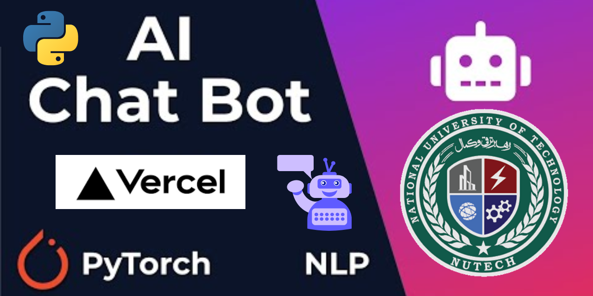
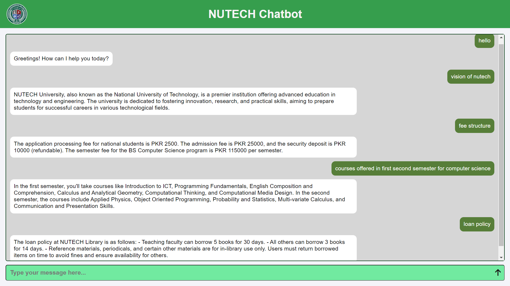

# NUTECH ChatBot: PyTorch-Based Contextual Chatbot with an Intuitive GUI

This project is a customized implementation of a contextual chatbot for NUTECH, designed to provide efficient and intuitive interaction with users. The chatbot is built using PyTorch and features a graphical user interface for ease of use.

## Features

- Easy-to-follow implementation, ideal for beginners to understand the basics of chatbots.
- Utilizes a Feed Forward Neural Network with 2 hidden layers.
- Simple customization for various use cases by modifying `intents.json`.
- Added graphical user interface (GUI) for a more intuitive user experience.

## Project Thumbnail



## Project Overview

This chatbot leverages the simplicity and power of PyTorch to deliver a responsive and adaptable conversational agent. The design includes:

- **Intent recognition**: Identifying the user's intent based on their input.
- **Response generation**: Providing appropriate responses based on the recognized intent.
- **GUI**: An intuitive interface to enhance user interaction.

## GUI Snapshot



## Installation

### Create a Virtual Environment

Set up a virtual environment using your preferred method (`conda` or `venv`):

```bash
mkdir myproject
cd myproject
python3 -m venv venv
```

### Create a Virtual Environment

#### For Mac / Linux:

```
source venv/bin/activate
```

```
venv\Scripts\activate
```
### Install Dependencies

Ensure you have the necessary dependencies installed:

```
pip install -r requirements.txt
```

#### requirements.txt
```
Flask
torch
scikit-learn
numpy
```
#### Additional Setup for NLTK
If you encounter issues with NLTK, install the necessary tokenizer data:

```
pip install nltk
python -m nltk.downloader punkt
```
## Usage
### Training the Model
To train the model and generate data.pth:

```
python train.py
```
### Running the Chatbot
To start the chatbot:
```
python app.py
```

## Customization
The chatbot's responses can be easily customized by editing the intents.json file. Define new tags, patterns, and responses as needed. After making changes, retrain the model:

```
python train.py
```
### Example format of intents.json:

```
{
  "intents": [
    {
      "tag": "greeting",
      "patterns": [
        "Hi",
        "Hey",
        "How are you",
        "Is anyone there?",
        "Hello",
        "Good day"
      ],
      "responses": [
        "Hey :-)",
        "Hello, thanks for visiting",
        "Hi there, what can I do for you?",
        "Hi there, how can I help?"
      ]
    }
  ]
}
```
## Deployment on Vercel
Follow these steps to deploy your chatbot project on Vercel:

### Install Vercel CLI: 
Ensure you have the Vercel CLI installed on your local machine.
```
npm install -g vercel
```
### Login to Vercel: 
Login to your Vercel account via CLI.

```
vercel login
```
Initialize the Project: Navigate to your project directory and initialize it with Vercel.

```
vercel
```
### Configure Project: 
During the initialization, Vercel will prompt you to configure your project settings. Ensure the settings are as follows:

- Framework Preset: ' Other '
- Build Command: 'python train.py' && 'python app.py'
- Output Directory: ' . ' (root directory)
### Deploy: Deploy your project.

```
vercel deploy
```

## Conclusion
This NUTECH chatbot project demonstrates a fundamental approach to building contextual chatbots using PyTorch. With its easy customization and user-friendly GUI, it serves as a robust starting point for developing advanced conversational agents.